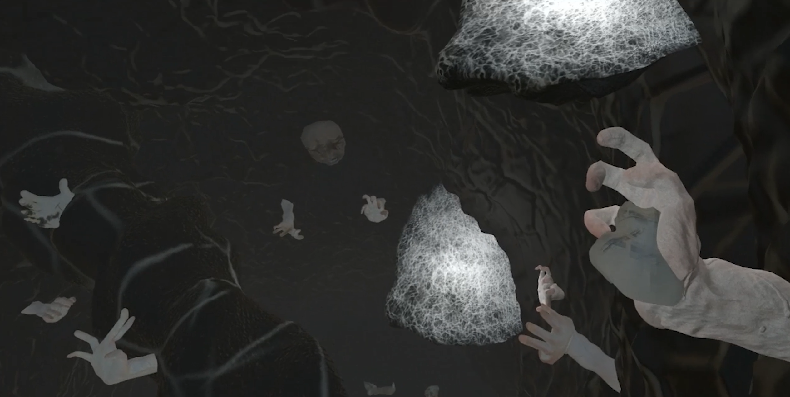

  

# Jack's Ascent

A **VR horror game about climbing** — built in **Unity (C#)** for Meta Quest-class headsets.

Climb, look up, and don't fall. A first-person VR horror experience built around climbing mechanics: height as tension, and atmosphere over UI.

[Demo video](https://youtu.be/37_8r6TYhKo)

## Getting started

Open in **Unity 6** (`6000.0.x`). This is a VR project — it includes Meta XR / Oculus and FMOD integration folders, and a full build needs the corresponding device SDKs configured in the Unity project.

## Project layout

- `Assets/` — scenes, climbing/interaction code, level geometry
- `Assets/MetaXR`, `Assets/Oculus` — XR integration (Meta Quest)
- `Assets/FMOD` — audio integration
